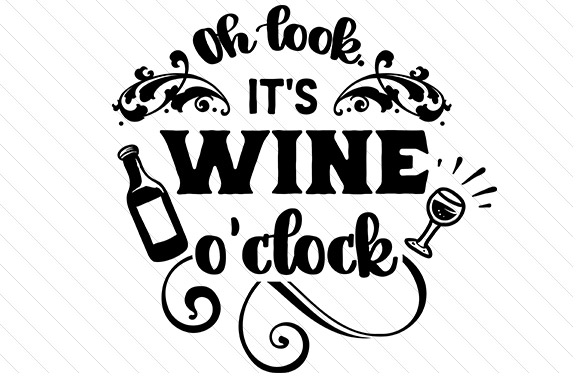

# Woodenville-Winery

## Objective to Project

Hi! our goal is to showcase diversity sites of **wineries** around Washington state and king county. To develop local cylture and build up community resources. Also to see the *beauty* of the process of making wine.

## 5 Wineries located in Woodinville WA

Columbia Winery

* 14030 NE 145th St, Woodinville, WA 98072

* (425) 482-7490

Novelty Hill-januik winery

* 14710 Redmond - Woodinville Rd NE, Woodinville, WA 98072

* (425) 481-5502

Jm cellars

* 14404 137th Pl NE, Woodinville, WA 98072

* (425) 485-6508

DeLille Cellars Tasting Room

* 14300 NE 145th St Suite 101, Woodinville, WA 98072

* (425) 489-0544

Avennia Tasting Room

* 19255 Woodinville Snohomish Rd #1, Woodinville, WA 98072

* (425) 482-4364

## 5 Wineries located in Seattle WA
Champion Wine Cellars

* 8515 Greenwood Ave N, Seattle, WA 98103

* (206) 284-8306

Almquist Winery

* 198 Nickerson St, Seattle, WA 98109

* (206) 953-2962

Rotie Cellars

* 3861 1st Ave S Suite F, Seattle, WA 98134

* (206) 359-0905

Nine Hats Wine

* 3861 1st Ave S, Seattle, WA 98134

* (206) 582-0700

Eight Bells Winery

* 6213 Roosevelt Way NE ste b, Seattle, WA 98115

(206) 294-4131

## 5 Wineries located in Walla Walla WA

Foundry Vineyards

* 1111 Abadie St, Walla Walla, WA 99362

* (509) 529-0736

Seven Hills Winery

* 212 N 3rd Ave, Walla Walla, WA 99362

(509) 529-7198

El Corazon Winery

* 37 S Palouse St, Walla Walla, WA 99362

* (509) 520-4408

Gard Vintners

* 43 E Main St, Walla Walla, WA 99362

* (509) 524-9099

The Walls Vineyards

* 1015 W Pine St, Walla Walla, WA 99362

* (509) 876-0200

